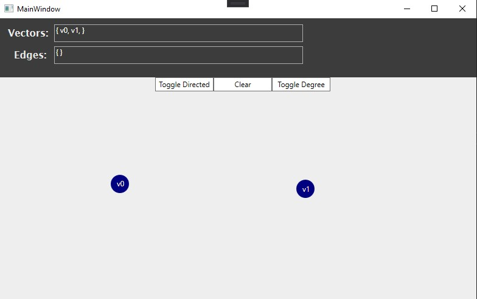
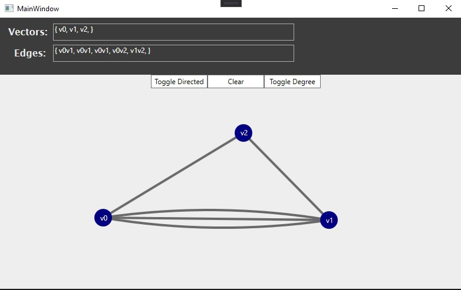
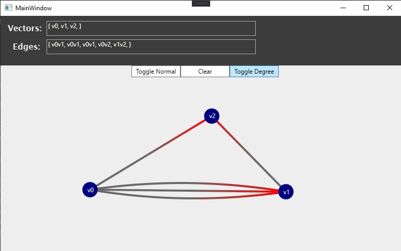
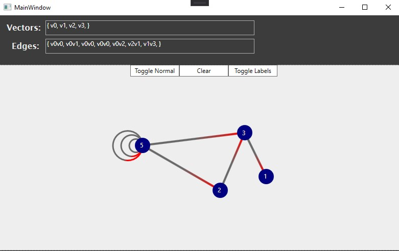

# Graph Theory Sketch Pad

## Project summary

I created this project as a tool to be used by graph theorist. The project allows for basic graph node interactions. Allot of graph theory concepts are easier to understand when visualized; This tool was made for that purpose. 

## Basic Examples

### Creating two vertices

### Creating normal & parallell edges

### Toggleling directed edge mode

### Adding loops and toggling degree mode

